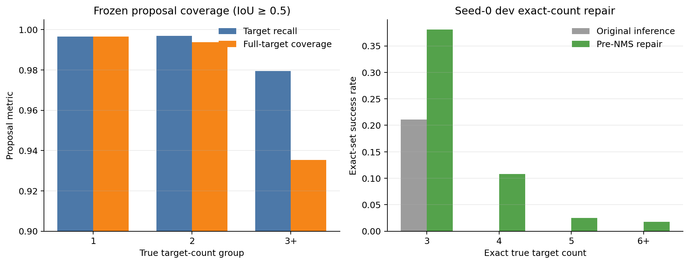
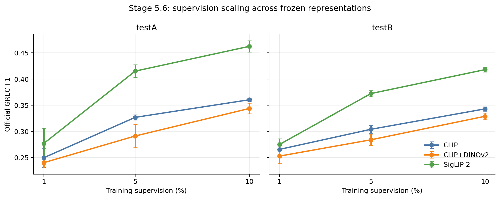
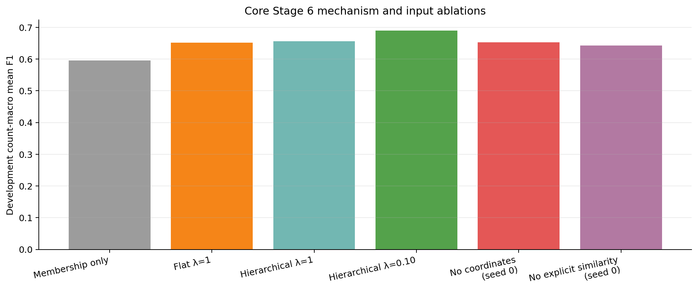
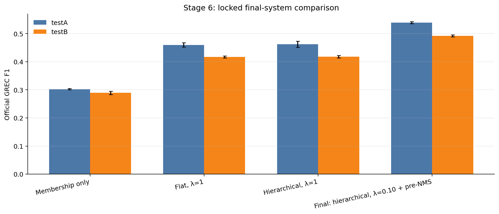
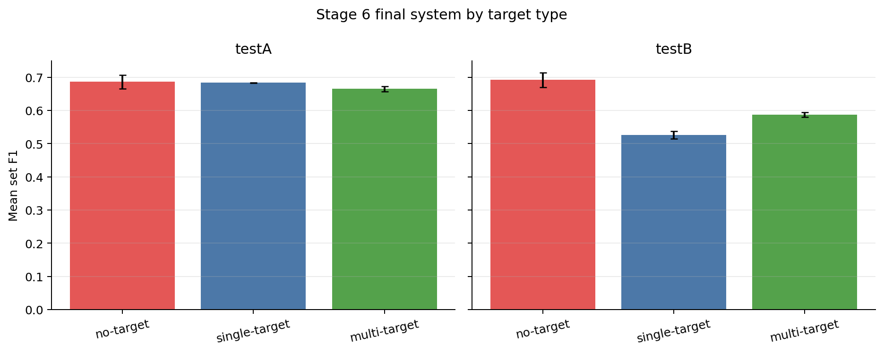
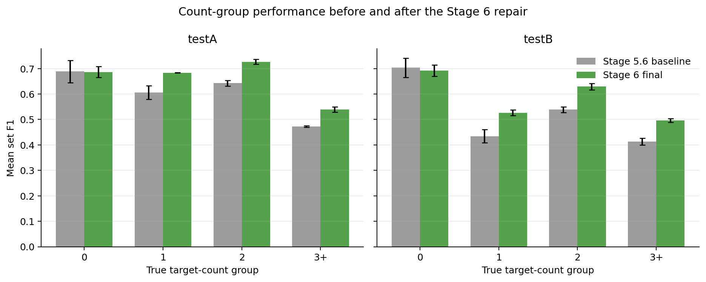
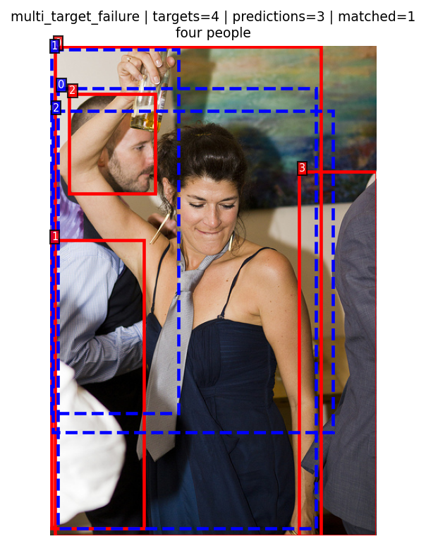
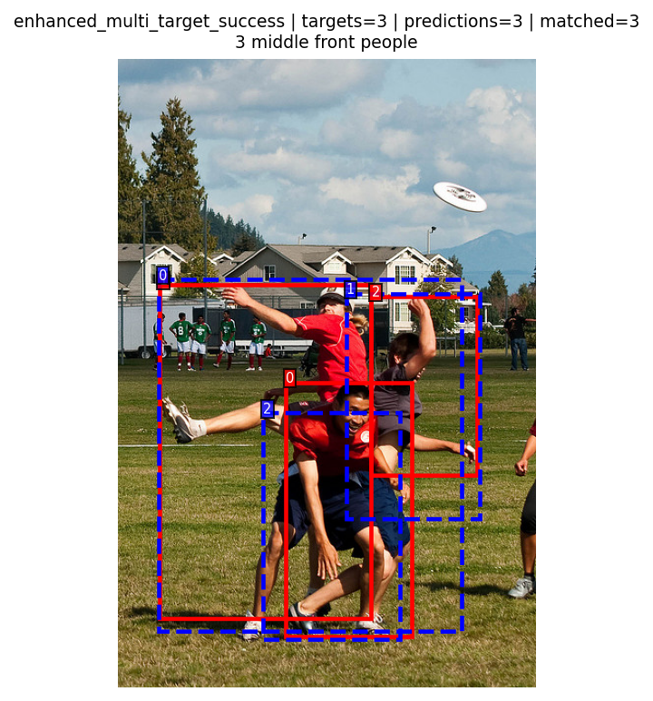

# Beyond Single-Target Grounding

## A Few-Shot Study of Generalized Referring Expression Comprehension with Frozen Representations

## Abstract

Generalized referring expression comprehension (GREC) requires a model to
return an empty set, one box, or multiple boxes for a natural-language query.
This project studies whether that behavior can be learned with limited
supervision while keeping large pretrained encoders frozen. A shared frozen
Faster R-CNN produces at most 100 candidate boxes per image. Frozen CLIP,
CLIP+DINOv2, or SigLIP 2 representations describe each candidate and query, and
a lightweight trainable head predicts candidate membership and a hierarchical
`0/1/2/3+` target count. The controlled main experiment covers 1%, 5%, and 10%
of gRefCOCO training supervision with three paired seeds. SigLIP 2 is strongest
for every split/fraction combination, while simple CLIP+DINOv2 concatenation
consistently trails CLIP. A subsequent development-only mechanism study finds
that explicit cardinality, normalized box coordinates, and image-text
similarity all contribute. Reducing the cardinality-loss weight to 0.10 and
performing class-agnostic NMS before count-gated selection raises the 10%
SigLIP 2 official F1 from `0.4625` to `0.5390` on testA and from `0.4180` to
`0.4921` on testB. The system remains limited on five-or-more-target scenes,
where supervision is scarce and frozen detector coverage degrades.

## 1. Research question

The project asks:

> Under few-shot supervision, which frozen visual-language representation best
> supports reliable no-target, single-target, and multi-target grounding with a
> small shared prediction head?

The goal is a controlled representation study, not a new large end-to-end GREC
architecture. Every required representation uses the same candidate pools,
few-shot samples, prediction-head policy, optimization schedule, and official
evaluation implementation.

## 2. Related work

GREC and gRefCOCO remove the standard REC assumption that every expression has
exactly one target [1]. Earlier proposal-based REC systems such as MAttNet [2]
and the CLIP-based ReCLIP baseline [3] motivate candidate-region scoring and
explicit location cues. This project compares frozen CLIP [4], DINOv2 [5], and
SigLIP 2 [6]; RegionCLIP [7] motivates the optional region-aligned extension.
RECANTFormer [8] and HieA2G [9] show how larger supervised GREC systems model
variable target counts, but they are not same-supervision controls for this
few-shot study. C-REC [10] and FineCops-Ref [11] motivate the conditional
counterfactual reliability audit.

## 3. Method

For image \(I\), expression \(T\), and frozen candidate set \(B\), the system
predicts a membership probability for each candidate:

\[
p_i = P(b_i \in Y \mid I,T,B),
\]

where \(Y\) is the target box set. The candidate head receives:

- a frozen region representation;
- the frozen expression representation;
- an explicit normalized region-text similarity;
- normalized box coordinates.

A pooled hierarchical cardinality head first predicts whether the target set
is empty, then distinguishes `1`, `2`, and `3+` for nonempty samples. The
training loss is:

\[
\mathcal{L}
=
\mathcal{L}_{membership}
+
\lambda_{cardinality}\mathcal{L}_{cardinality}.
\]

The final head has 726,790 trainable parameters. The selected SigLIP 2 encoder
has 375,187,970 frozen parameters and zero trainable encoder parameters.

At final inference, all candidate boxes are ranked by membership probability.
Class-agnostic NMS with IoU 0.30 is applied to the full ranked pool before the
cardinality decision selects boxes. For the `3+` branch, every surviving
candidate above probability 0.50 is retained, with a minimum of three.

## 4. Data and protocol

The main dataset is gRefCOCO. The final Stage 5.6 protocol starts from all
209,344 official training expressions and first removes one 854-image,
12,249-expression development set. Development images have zero overlap with
all new training splits. Its realized `0/1/2/3+` counts are
`1500/6707/3654/388`.

For every seed, the nested few-shot budgets are:

| Fraction | 0 | 1 | 2 | 3+ | Total |
|---|---:|---:|---:|---:|---:|
| 1% | 191 | 1,206 | 679 | 17 | 2,093 |
| 5% | 957 | 6,031 | 3,392 | 87 | 10,467 |
| 10% | 1,914 | 12,062 | 6,785 | 173 | 20,934 |

All recipe selection, epoch selection, loss-weight selection, NMS selection,
and calibration use development data only. Stage 5.6 evaluates 27 selected
models on testA/testB, producing 54 complete test evaluations. Stage 6 freezes
its final checkpoint, calibration, inference settings, and SHA-256 evidence
before one additional test gate. No Stage 6 test result triggers retraining,
recalibration, or structural changes.

The released gRefCOCO validation split was not used as the final selector
because it contains no single-target expressions. Earlier stages diagnosed
this issue; Stage 5.6 replaces that incomplete selection route with the
image-disjoint all-count development protocol above.

## 5. Frozen proposal quality

The shared proposal generator is Faster R-CNN ResNet50-FPN v2. Across the Stage
5.6 feature union, it produces an average of 38.64 candidates per expression.
At IoU 0.5:

| Diagnostic | Value |
|---|---:|
| Unique-target recall | 0.9951 |
| Expression-weighted target recall | 0.9960 |
| Full-target sample coverage | 0.9948 |
| `3+` target recall | 0.9794 |
| `3+` full-target coverage | 0.9354 |

The proposal pool is therefore strong overall but is not an oracle. A matched
Stage 3 validation diagnostic obtains official F1 `0.7031` with COCO
ground-truth instance candidates and `0.6408` with frozen detector candidates.
Because proposal miss rate is much smaller than this performance gap, the gap
also includes detector distractors, overlapping candidates, ranking, and
cardinality errors.

## 6. Main controlled result: representation and supervision

Values are official GREC F1, mean ± sample standard deviation over paired seeds
0/1/2.

| Split | Representation | 1% | 5% | 10% |
|---|---|---:|---:|---:|
| testA | CLIP | 0.2496 ± 0.0185 | 0.3268 ± 0.0048 | 0.3605 ± 0.0028 |
| testA | CLIP+DINOv2 | 0.2402 ± 0.0097 | 0.2911 ± 0.0223 | 0.3438 ± 0.0103 |
| testA | **SigLIP 2** | **0.2769 ± 0.0295** | **0.4151 ± 0.0122** | **0.4625 ± 0.0107** |
| testB | CLIP | 0.2656 ± 0.0125 | 0.3039 ± 0.0072 | 0.3430 ± 0.0041 |
| testB | CLIP+DINOv2 | 0.2528 ± 0.0145 | 0.2839 ± 0.0109 | 0.3288 ± 0.0065 |
| testB | **SigLIP 2** | **0.2749 ± 0.0108** | **0.3722 ± 0.0058** | **0.4180 ± 0.0044** |

Three conclusions follow:

1. SigLIP 2 has the highest mean F1 in all six controlled split/fraction
   comparisons.
2. Every representation improves monotonically as supervision grows from 1%
   to 10%.
3. The tested CLIP+DINOv2 concatenation trails CLIP in all six comparisons.
   This is evidence against the proposed *simple fusion*, not evidence that
   DINOv2 cannot help under any fusion design.

## 7. Mechanism ablations

On the development set, three-seed count-macro mean F1 is:

| Mechanism | Count-macro mean F1 |
|---|---:|
| Membership only | 0.5952 ± 0.0006 |
| Flat cardinality, λ=1 | 0.6516 ± 0.0024 |
| Hierarchical cardinality, λ=1 | 0.6565 ± 0.0063 |
| **Hierarchical cardinality, λ=0.10** | **0.6892 ± 0.0030** |

The seed-0 λ search covers `0.05, 0.10, 0.125, 0.25, 0.5, 1, 2`. The peak at
0.10 is bracketed by worse values at 0.05 and 0.125 and is then confirmed over
three seeds. Removing normalized box coordinates lowers seed-0 macro F1 by
`0.0370`; removing explicit image-text similarity lowers it by `0.0469`.
Coordinates and similarity are standard inputs, so these experiments establish
their contribution to this system rather than claiming them as novel methods.

## 8. Duplicate-candidate diagnosis and final system

The original count-gated selector could rank several overlapping proposals for
the same object above a different true object. Applying NMS after selecting
three boxes only deletes a duplicate; it cannot replenish the result with the
next distinct candidate. Stage 6 therefore applies NMS before cardinality
selection.

The NMS IoU search spans 0.0–0.7 and peaks at 0.30, bracketed by worse values
at 0.20 and 0.40. After changing candidate order, the `3+` membership threshold
is recalibrated over its complete legal domain and peaks at 0.50, bracketed by
0.40 and 0.60.

The locked final test result is:

| System | testA F1 | testB F1 | testA mean set F1 | testB mean set F1 |
|---|---:|---:|---:|---:|
| Membership only | 0.3022 ± 0.0022 | 0.2892 ± 0.0057 | 0.5604 ± 0.0020 | 0.4846 ± 0.0038 |
| Flat, λ=1 | 0.4599 ± 0.0080 | 0.4172 ± 0.0035 | 0.6121 ± 0.0057 | 0.5348 ± 0.0052 |
| Stage 5.6 hierarchical, λ=1 | 0.4625 ± 0.0107 | 0.4180 ± 0.0044 | 0.6162 ± 0.0079 | 0.5361 ± 0.0032 |
| **Final: hierarchical, λ=0.10 + pre-NMS** | **0.5390 ± 0.0036** | **0.4921 ± 0.0033** | **0.6760 ± 0.0025** | **0.5965 ± 0.0036** |

The final system improves official F1 over the frozen Stage 5.6 baseline by
`0.0765` on testA and `0.0741` on testB. This is a combined-system improvement:
the test comparison changes both λ and inference. Development experiments, not
additional test comparisons, isolate their individual effects.

The gain primarily improves target-set prediction. `T_acc` is nearly unchanged,
while `N_acc` falls by `0.0017` on testA and `0.0114` on testB. The result
therefore includes a small cost in empty-set rejection, especially on testB.

## 9. Target-type and high-count behavior

Final-system mean set F1 is:

| Split | No target | Single target | Multi target |
|---|---:|---:|---:|
| testA | 0.6868 ± 0.0209 | 0.6839 ± 0.0007 | 0.6652 ± 0.0081 |
| testB | 0.6921 ± 0.0222 | 0.5263 ± 0.0108 | 0.5877 ± 0.0074 |

The final system improves mean F1 for the `1`, `2`, and `3+` count groups on
both tests relative to Stage 5.6. It does not solve fine-grained high counts.
On seed-0 development data, exact 3/4/5/6+ successes change from
`46/0/0/0` to `83/8/1/1`. The repair reduces three-target duplicate-selection
failures from 96 to 2, but five- and six-or-more-target exact recovery remains
rare.

Two bottlenecks explain this:

- the 10% seed-0 training split contains only `94/35/12/32` examples with
  exact counts `3/4/5/6+`;
- frozen proposal full coverage for the development `6+` group is only 0.7143.

## 10. Qualitative analysis

The Stage 6 renderer uses the same image, target, candidate, and metric
conventions for the original and repaired inference policies. The complete
manifest contains 16 examples spanning no-target, single-target, two-target,
and multi-target successes and failures.

| Original-inference multi-target failure | Repaired-inference multi-target success |
|---|---|
|  |  |

These are representative categories, not a claim that every original failure
is repaired. The remaining enhanced failure cases show proposal misses,
high-count underprediction, and difficult ranking in crowded scenes.

## 11. Counterfactual reliability

The proposal makes C-RefCOCO, C-RefCOCO+, and C-RefCOCOg conditional on
compatible preprocessing and treats FineCops-Ref as optional. A Stage 6 local
audit scans 82,804 files and confirms that COCO images are present but these
counterfactual annotation files are absent. No counterfactual metric is
fabricated or inferred from this absence. This is a local availability
limitation, not evidence of intrinsic dataset incompatibility or poor model
performance.

## 12. Limitations

1. The final system uses frozen detector candidates and cannot recover targets
   absent from that pool.
2. The `3+` head does not directly distinguish 3, 4, 5, and 6+; high-count
   supervision is extremely sparse.
3. Hard class-agnostic NMS can suppress different true objects when they overlap
   strongly. Its net development effect and the combined final-system result
   are positive, but test data do not isolate NMS from the λ change.
4. Three seeds provide a useful stability check but only a coarse estimate of
   training variance.
5. Trainable head sizes differ across raw representation dimensions; the
   planned parameter-matched PCA control was removed under the pre-test Stage 6
   time reduction.
6. Counterfactual datasets and RegionCLIP were not locally completed.
7. Specialized fully supervised systems such as RECANTFormer and HieA2G are
   literature context, not controlled same-supervision competitors here.
8. Earlier Stage 5 tests were observed before the Stage 5.6 protocol reset.
   The defensible claim is that no Stage 5.6/6 test metric was used for their
   model selection, calibration, or retraining—not that test splits were never
   seen during the project lifetime.

## 13. Proposal commitment outcome

| Proposal item | Outcome |
|---|---|
| gRefCOCO main dataset | Completed |
| 1%/5%/10% few-shot supervision | Completed |
| Multiple random samples/seeds | Completed with seeds 0/1/2 |
| Shared frozen proposal generator | Completed |
| Proposal recall diagnostic | Completed |
| CLIP | Completed |
| CLIP+DINOv2 | Completed; simple fusion is a negative result |
| SigLIP 2 | Completed; strongest required representation |
| RegionCLIP | Optional; not completed |
| Frozen encoders and lightweight head | Completed |
| Empty/single/multiple output | Completed |
| Cardinality-aware prediction | Completed and ablated |
| Official GREC evaluation | Completed |
| No/single/multi breakdown | Completed |
| C-RefCOCO family | Conditional; local annotations unavailable |
| FineCops-Ref | Optional; local annotations unavailable |
| Targeted qualitative analysis | Completed |
| Reproducible commands/manifests | Completed |

## 14. Conclusion

The original central hypothesis is supported: a frozen representation plus a
small cardinality-aware adapter can learn useful generalized grounding from
limited supervision, and representation choice materially affects the result.
SigLIP 2 provides the best tested frozen representation. The hypothesis that
simple CLIP+DINOv2 concatenation would improve discrimination is not supported.
The project also shows that much of the remaining error is not raw proposal
recall; it comes from cardinality, duplicate candidates, ranking, and sparse
high-count supervision. A small training-loss correction and a query-scored
pre-selection NMS repair yield a substantial final gain without fine-tuning the
375-million-parameter encoder.

## References

[1] S. He, H. Ding, C. Liu, and X. Jiang. “GREC: Generalized Referring
Expression Comprehension.” 2023.

[2] L. Yu, Z. Lin, X. Shen, et al. “MAttNet: Modular Attention Network for
Referring Expression Comprehension.” CVPR, 2018.

[3] S. Subramanian, W. Merrill, T. Darrell, et al. “ReCLIP: A Strong Zero-Shot
Baseline for Referring Expression Comprehension.” ACL, 2022.

[4] A. Radford, J. W. Kim, C. Hallacy, et al. “Learning Transferable Visual
Models From Natural Language Supervision.” ICML, 2021.

[5] M. Oquab, T. Darcet, T. Moutakanni, et al. “DINOv2: Learning Robust Visual
Features without Supervision.” TMLR, 2024.

[6] M. Tschannen, A. Gritsenko, X. Wang, et al. “SigLIP 2: Multilingual
Vision-Language Encoders with Improved Semantic Understanding, Localization,
and Dense Features.” 2025.

[7] Y. Zhong, J. Yang, P. Zhang, et al. “RegionCLIP: Region-Based
Language-Image Pretraining.” CVPR, 2022.

[8] B. Hemanthage, H. Bilen, P. Bartie, et al. “RECANTFormer: Referring
Expression Comprehension with Varying Numbers of Targets.” EMNLP, 2024.

[9] Y. Wang, H. Ding, S. He, et al. “Hierarchical Alignment-Enhanced Adaptive
Grounding Network for Generalized Referring Expression Comprehension.” AAAI,
2025.

[10] Z. Yu and R. Li. “Revisiting Counterfactual Problems in Referring
Expression Comprehension.” CVPR, 2024.

[11] J. Liu, X. Yang, W. Li, and P. Wang. “FineCops-Ref: A New Dataset and Task
for Fine-Grained Compositional Referring Expression Comprehension.” EMNLP,
2024.
